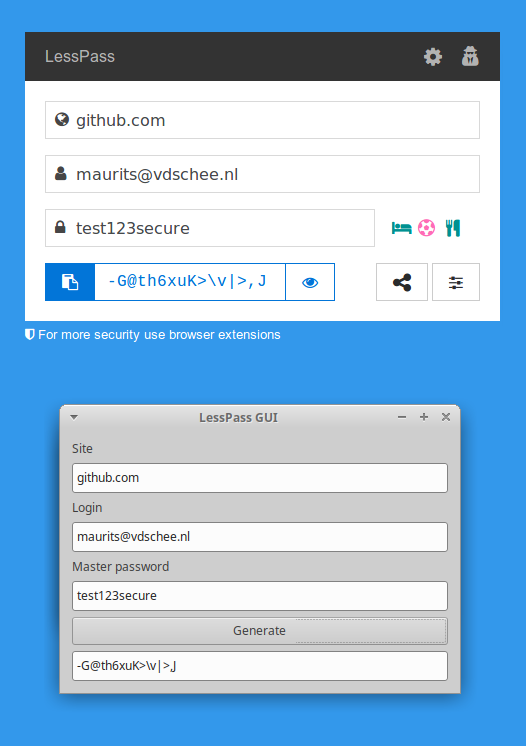

# lesspass-gui

A GUI for the [lesspass.go](https://github.com/mevdschee/lesspass.go/) package (written in Go).

The screenshot shows the official LessPass site widget (left) and this project (right) with the same output.

see: https://lesspass.com

### building

To build, run:

    go build

If you get:

    No package 'gtk+-3.0' found

You need to install:

    sudo apt install libgtk-3-dev

To execute, run:

    ./lesspass-gui
    
Enjoy!
